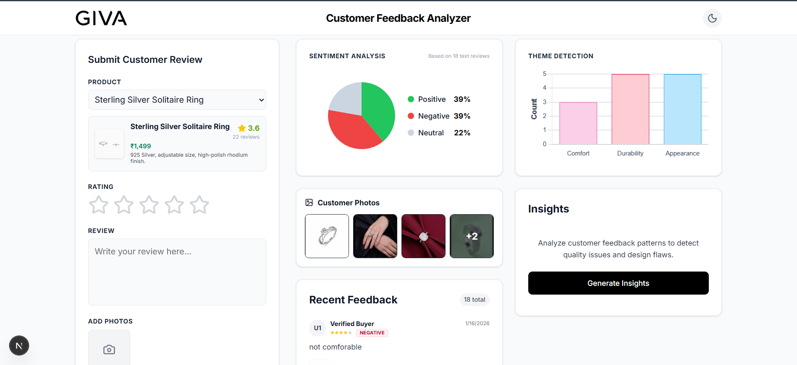

# Customer Feedback Dashboard

A real-time dashboard for analyzing customer reviews, featuring sentiment analysis, theme detection, and smart insights without relying on external AI APIs.

Link to deployment - https://giva-feedback-dashboard.vercel.app

## 📸 Dashboard Preview

| **Dashboard View** | **Feedback Form & Insights** |
|:---:|:---:|
|   |

---

## 🚀 How to Start Locally

Follow these steps to run the project on your local machine.

### 1. Clone the Repository
```bash
git clone https://github.com/mantraj23/giva-feedback-dashboard
cd giva-feedback-dashboard

```

### 2. Install Dependencies

```bash
npm install
# or
yarn install

```

### 3. Environment Setup

Create a `.env` file in the root directory and add your MongoDB connection string and Cloudinary credentials (for image uploads).

```env
MONGODB_URI=your_mongodb_connection_string
NEXT_PUBLIC_CLOUDINARY_CLOUD_NAME=your_cloud_name
NEXT_PUBLIC_CLOUDINARY_PRESET=your_upload_preset

```

### 4. Run the Development Server

```bash
npm run dev
# or
yarn dev

```

Open [http://localhost:3000](https://www.google.com/search?q=http://localhost:3000) with your browser to see the result.

---

# 📡 Backend API Documentation

This project uses Next.js Route Handlers to serve data stored in MongoDB. Below are the available endpoints.

## 1. Feedback API

### **GET** `/api/feedback`
Fetches the list of reviews for a specific product.

* **Query Parameters:**
    * `productId` (required): The ID of the product to filter reviews by (e.g., `101`).

* **Response Example:**
    ```json
    [
      {
        "_id": "65a1b2c3d4e5f67890123456",
        "productId": "101",
        "text": "The ring is beautiful but the sizing fits small.",
        "rating": 4,
        "images": ["[https://res.cloudinary.com/.../image.jpg](https://res.cloudinary.com/.../image.jpg)"],
        "sentiment": "Neutral",
        "themes": ["Appearance", "Comfort"],
        "createdAt": "2023-10-25T14:48:00.000Z"
      }
    ]
    ```

### **POST** `/api/feedback`
Submits a new review to the database.

* **Request Body (JSON):**
    ```json
    {
      "productId": "101",
      "text": "Absolutely love this! It sparkles so much.",
      "rating": 5,
      "images": ["[https://res.cloudinary.com/.../image.jpg](https://res.cloudinary.com/.../image.jpg)"],
      "sentiment": "Positive",  // Calculated by analyzer.ts on client
      "themes": ["Appearance"],   // Calculated by analyzer.ts on client
      "score": 5                  // Raw sentiment score
    }
    ```

* **Response Example:**
    ```json
    {
      "message": "Review added successfully",
      "success": true,
      "data": { ... } // The created review object
    }
    ```

---

## 2. Insights API

### **GET** `/api/insights`
Generates aggregated statistics and AI-like summaries based on the feedback patterns for a product.

* **Query Parameters:**
    * `productId` (required): The ID of the product to analyze.

* **Response Example:**
    ```json
    {
      "stats": {
        "Comfort": { "pos": 5, "neg": 2, "total": 7 },
        "Durability": { "pos": 1, "neg": 4, "total": 5 },
        "Appearance": { "pos": 10, "neg": 0, "total": 10 }
      },
      "insights": [
        "CRITICAL: Multiple reports of stones falling out (Durability).",
        "Customers frequently praise the 'shiny' finish (Appearance).",
        "Sizing runs small according to 30% of reviews."
      ]
    }
    ```
---

## 🧠 Smart Analysis Logic (`analyzer.ts`)

The core of this project is a custom-built, local analysis engine that processes text **without external AI costs**. It uses a weighted dictionary, stemming, and fuzzy matching to determine sentiment and themes.

### Key Features

1. **Sentiment Scoring:**
* Words are assigned positive or negative scores (e.g., "love": +3, "broken": -5).
* **Context Awareness:** Detects negators. If "good" (+1) is preceded by "not", it becomes "not good" (-1).
* **Final Verdict:**
* Total Score > 0 → 🟢 **Positive**
* Total Score < 0 → 🔴 **Negative**
* Total Score = 0 → ⚪ **Neutral**


2. **Smart Stemming (Suffix Handling):**
* The analyzer understands that variations of a word mean the same thing.
* *Example:* "Nicely" is treated as "Nice". "Sparkling" is treated as "Sparkle".


3. **Fuzzy Matching (Typo Tolerance):**
* Uses **Levenshtein Distance** to catch spelling mistakes.
* *Example:* If a user types "awsome" or "exellent", the system correctly identifies them as "awesome" and "excellent" and assigns the correct positive score.


### Examples

| Review Text | Analysis Output | Why? |
| --- | --- | --- |
| *"This ring is absolutly awsome."* | 🟢 **Positive** | "awsome" is corrected to "awesome" (+3). |
| *"The fit is not good."* | 🔴 **Negative** | "good" (+1) is negated by "not" (-1). |
| *"Horrible quality, it snapped."* | 🔴 **Negative** | "horrible" (-4) and "snapped" (implies broken) drive score down. |
| *"It fits nicely."* | 🟢 **Positive** | "nicely" is stemmed to "nice" (+2). |

---

## 🛠️ Tech Stack

* **Framework:** Next.js (App Router)
* **Language:** TypeScript
* **Database:** MongoDB (Mongoose)
* **Styling:** Tailwind CSS
* **Icons:** Lucide React
* **Charts:** Chart.js
* **Image Storage:** Cloudinary

```

```